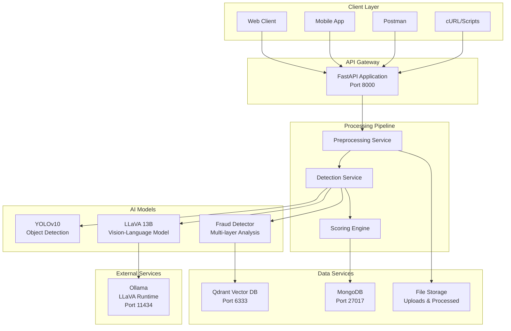
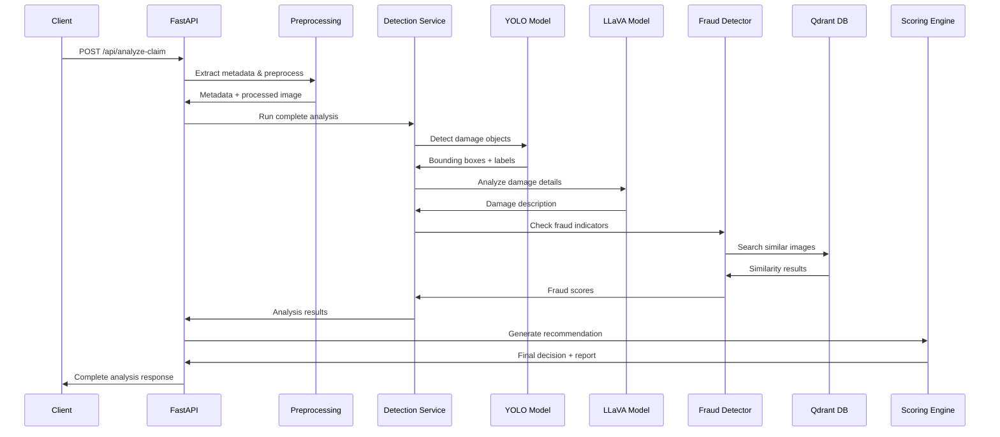

# 🛡️ Insurance Claim Validator

An AI-powered insurance claim validation system that uses computer vision and large language models to automatically analyze, validate, and detect fraud in vehicle damage claims.

[](https://www.python.org/)
[](https://fastapi.tiangolo.com/)
[](https://www.docker.com/)
[](LICENSE)

---

## 📋 Table of Contents

- [Overview](#-overview)
- [Features](#-features)
- [System Architecture](#-system-architecture)
- [Project Structure](#-project-structure)
- [Prerequisites](#-prerequisites)
- [Installation](#-installation)
- [Running the Project](#-running-the-project)
  - [Option 1: Docker Compose (Recommended)](#option-1-docker-compose-recommended)
  - [Option 2: Manual Setup](#option-2-manual-setup)
- [API Documentation](#-api-documentation)
- [Configuration](#-configuration)
- [Testing](#-testing)
- [Technology Stack](#-technology-stack)
- [Performance](#-performance)
- [Troubleshooting](#-troubleshooting)
- [Contributing](#-contributing)
- [License](#-license)

---

## 🎯 Overview

The Insurance Claim Validator is an end-to-end machine learning system designed to automate the validation of insurance claims through intelligent image analysis. The system combines multiple AI models and fraud detection techniques to provide accurate, fast, and reliable claim assessments.

### Key Capabilities

- **Automated Damage Detection**: Uses YOLOv10 to identify and locate vehicle damage
- **Intelligent Damage Analysis**: Leverages LLaVA vision-language model for detailed damage assessment
- **Fraud Detection**: Multi-layer fraud detection including duplicate image detection, metadata analysis, and consistency checks
- **Automated Decision Making**: Smart scoring engine that generates actionable recommendations (APPROVE/REJECT/MANUAL_REVIEW)
- **Real-time Processing**: Fast API-based architecture for instant claim analysis

---

## ✨ Features

### Core Features

- 🔍 **Object Detection**: YOLOv10-based damage detection with bounding box annotations
- 🤖 **Vision-Language Analysis**: LLaVA 13B model for detailed damage descriptions
- 🚨 **Fraud Detection System**:
  - Duplicate image detection using perceptual hashing and vector similarity
  - EXIF metadata validation and tampering detection
  - Consistency analysis between claim description and detected damage
- 📊 **Intelligent Scoring Engine**: Multi-factor scoring with weighted criteria
- 🎯 **Automated Recommendations**: Business rule-based decision making
- 📝 **Comprehensive Reports**: Human-readable explanations for every decision
- 🖼️ **Image Preprocessing**: Automatic image enhancement and normalization
- 💾 **Vector Database Integration**: Qdrant for efficient duplicate detection
- 🔄 **RESTful API**: FastAPI-based endpoints with automatic documentation

### Advanced Features

- Health monitoring and status checks
- Persistent claim history storage
- Annotated image generation
- Batch processing capabilities
- Extensible plugin architecture

---

## 🏗️ System Architecture



### Data Flow Architecture



---

## 📁 Project Structure

```
insurance-claim-validator/
├── 📄 README.md                          # This file
├── 📄 ARCHITECTURE.md                    # Detailed architecture documentation
├── 📄 IMPLEMENTATION_SUMMARY.md          # Implementation notes
├── 📄 DOCKER_SETUP.md                    # Docker deployment guide
├── 📄 QUICK_REFERENCE.md                 # Quick command reference
├── 🐳 docker-compose.yml                 # Docker orchestration
│
├── ml-backend/                           # Main application directory
│   ├── 📄 Dockerfile                     # Container definition
│   ├── 📄 requirements.txt               # Python dependencies
│   ├── 📄 requirements_gpu.txt           # GPU-accelerated dependencies
│   ├── 📄 download_models.py             # Model download script
│   ├── 📄 yolov10m.pt                    # YOLOv10 model weights
│   │
│   ├── app/                              # FastAPI application
│   │   ├── 📄 __init__.py
│   │   ├── 📄 main.py                    # API entry point & routes
│   │   │
│   │   ├── api/                          # API layer
│   │   │   └── 📄 routes.py              # Additional route handlers
│   │   │
│   │   ├── models/                       # AI Model wrappers
│   │   │   ├── 📄 yolo_detector.py       # YOLO detection model
│   │   │   ├── 📄 llava_analyzer.py      # LLaVA analysis model
│   │   │   └── 📄 fraud_detector.py      # Fraud detection system
│   │   │
│   │   ├── services/                     # Business logic services
│   │   │   ├── 📄 preprocessing.py       # Image preprocessing & metadata
│   │   │   ├── 📄 detection_service.py   # Damage detection orchestration
│   │   │   ├── 📄 scoring_engine.py      # Decision & scoring engine
│   │   │   └── 📄 metadata_extractor.py  # EXIF & metadata extraction
│   │   │
│   │   └── utils/                        # Utility functions
│   │       ├── 📄 image_utils.py         # Image processing utilities
│   │       └── 📄 prompt_templates.py    # LLaVA prompt templates
│   │
│   ├── data/                             # Data storage
│   │   ├── uploads/                      # Uploaded claim images
│   │   │   ├── processed/                # Processed images
│   │   │   └── annotated/                # Annotated detection images
│   │   ├── qdrant_storage/               # Vector database storage
│   │   ├── model_offload/                # Model cache directory
│   │   └── image_hashes.json             # Perceptual hash database
│   │
│   ├── test_images/                      # Sample test images
│   │
│   └── tests/                            # Test scripts
│       ├── 📄 test_complete_pipeline.py  # End-to-end tests
│       ├── 📄 test_detection.py          # YOLO tests
│       ├── 📄 test_fraud_detection.py    # Fraud detection tests
│       ├── 📄 test_preprocessing.py      # Preprocessing tests
│       └── 📄 FullTest1to5.py            # Comprehensive test suite
│
└── venv_gpu/                             # Virtual environment (not in repo)
```

### Component Descriptions

#### **Core Application (`app/`)**

- **`main.py`**: FastAPI application entry point with all API endpoints
- **`models/`**: AI model wrapper classes for YOLO, LLaVA, and fraud detection
- **`services/`**: Business logic layer handling preprocessing, detection, and scoring
- **`utils/`**: Helper functions for image processing and prompt engineering

#### **Services Layer**

1. **Preprocessing Service** (`preprocessing.py`)
   - Image validation and normalization
   - EXIF metadata extraction
   - GPS and timestamp validation
   - Image quality enhancement

2. **Detection Service** (`detection_service.py`)
   - Orchestrates YOLO object detection
   - Manages LLaVA damage analysis
   - Coordinates fraud detection checks
   - Consolidates results

3. **Scoring Engine** (`scoring_engine.py`)
   - Multi-factor fraud scoring
   - Consistency analysis
   - Business rule application
   - Decision recommendation generation

#### **AI Models (`models/`)**

1. **YOLO Detector** (`yolo_detector.py`)
   - YOLOv10m model for object detection
   - Damage localization with bounding boxes
   - Multi-class vehicle damage detection

2. **LLaVA Analyzer** (`llava_analyzer.py`)
   - Vision-language model integration
   - Detailed damage description generation
   - Context-aware analysis

3. **Fraud Detector** (`fraud_detector.py`)
   - Perceptual hash-based duplicate detection
   - Qdrant vector similarity search
   - EXIF metadata tampering detection
   - Multi-layer fraud scoring

---

## 🔧 Prerequisites

### Required Software

| Component | Version | Purpose |
|-----------|---------|---------|
| **Python** | 3.10+ | Runtime environment |
| **Docker** | 20.10+ | Containerization (optional) |
| **Docker Compose** | 2.0+ | Multi-container orchestration |
| **Ollama** | Latest | LLaVA model runtime |
| **Git** | Any | Version control |
| **CUDA** | 11.8+ | GPU acceleration (optional) |

### System Requirements

#### Minimum Configuration
- **CPU**: 4 cores
- **RAM**: 8 GB
- **Storage**: 20 GB free space
- **OS**: Windows 10/11, Linux (Ubuntu 20.04+), macOS 12+

#### Recommended Configuration
- **CPU**: 8+ cores
- **RAM**: 16 GB+
- **GPU**: NVIDIA with 8GB+ VRAM (RTX 3060 or better)
- **Storage**: 50 GB SSD
- **OS**: Windows 11, Ubuntu 22.04, macOS 13+

### Required Models

1. **YOLOv10 Weights**: `yolov10m.pt` (already included)
2. **LLaVA Model**: `llava:13b` (downloaded via Ollama)

---

## 📦 Installation

### Step 1: Clone Repository

```bash
git clone https://github.com/your-org/insurance-claim-validator.git
cd insurance-claim-validator
```

### Step 2: Install Ollama

#### Windows
```powershell
# Download from https://ollama.ai/download/windows
# Or use winget
winget install Ollama.Ollama
```

#### Linux
```bash
curl -fsSL https://ollama.ai/install.sh | sh
```

#### macOS
```bash
brew install ollama
```

### Step 3: Pull LLaVA Model

```bash
ollama pull llava:13b
```

**Note**: This downloads ~8GB. Ensure stable internet connection.

### Step 4: Install Python Dependencies

#### Using Virtual Environment (Recommended)

```bash
# Create virtual environment
python -m venv venv

# Activate virtual environment
# Windows:
venv\Scripts\activate
# Linux/macOS:
source venv/bin/activate

# Install dependencies
cd ml-backend
pip install -r requirements.txt
```

#### For GPU Support

```bash
pip install -r requirements_gpu.txt
```

### Step 5: Download YOLO Model (if not included)

```bash
python download_models.py
```

---

## 🚀 Running the Project

### Option 1: Docker Compose (Recommended)

Docker Compose provides the easiest setup with all services configured automatically.

#### Start All Services

```bash
docker-compose up -d
```

This starts:
- **Qdrant** (Vector Database) on port 6333
- **MongoDB** (Claims Database) on port 27017
- **ML Backend** (FastAPI) on port 8000

#### Check Service Status

```bash
docker-compose ps
```

#### View Logs

```bash
# All services
docker-compose logs -f

# Specific service
docker-compose logs -f ml-backend
```

#### Stop Services

```bash
docker-compose down
```

#### Access Points

- **API**: http://localhost:8000
- **API Docs**: http://localhost:8000/docs
- **Qdrant Dashboard**: http://localhost:6333/dashboard
- **Health Check**: http://localhost:8000/health

---

### Option 2: Manual Setup

For development or when Docker is not available.

#### Step 1: Start Qdrant (Vector Database)

**Using Docker:**
```bash
docker run -p 6333:6333 -p 6334:6334 \
  -v $(pwd)/ml-backend/data/qdrant_storage:/qdrant/storage \
  qdrant/qdrant
```

**Using Qdrant Standalone:**
```bash
# Download from https://qdrant.tech/documentation/quick-start/
./qdrant
```

#### Step 2: Start MongoDB (Optional)

```bash
docker run -d -p 27017:27017 \
  -v $(pwd)/ml-backend/data/mongodb:/data/db \
  --name mongodb \
  mongo:latest
```

#### Step 3: Start Ollama Service

```bash
# Start Ollama server
ollama serve
```

**Verify LLaVA model:**
```bash
ollama list
```

#### Step 4: Configure Environment

Create `.env` file in `ml-backend/` directory:

```env
# Qdrant Configuration
USE_QDRANT=true
QDRANT_HOST=localhost
QDRANT_PORT=6333

# Ollama Configuration
OLLAMA_HOST=http://localhost:11434

# MongoDB Configuration (Optional)
MONGODB_URI=mongodb://localhost:27017/insurance_claims

# Application Settings
DEBUG=false
LOG_LEVEL=INFO
```

#### Step 5: Start FastAPI Server

```bash
cd ml-backend
python -m uvicorn app.main:app --host 0.0.0.0 --port 8000 --reload
```

**Output:**
```
INFO:     Uvicorn running on http://0.0.0.0:8000 (Press CTRL+C to quit)
INFO:     Started reloader process [12345] using WatchFiles
INFO:     Started server process [12346]
INFO:     Waiting for application startup.
INFO:     Application startup complete.
```

#### Verify Installation

```bash
# Test health endpoint
curl http://localhost:8000/health

# Expected response:
{
  "status": "healthy",
  "timestamp": "2025-12-17T10:30:00",
  "services": {
    "preprocessing": "✓",
    "yolo_detection": "✓",
    "llava_analysis": "✓",
    "fraud_detection": "✓",
    "scoring_engine": "✓"
  }
}
```

---

## 📚 API Documentation

### Interactive API Documentation

Once the server is running, access the auto-generated documentation:

- **Swagger UI**: http://localhost:8000/docs
- **ReDoc**: http://localhost:8000/redoc

### Core Endpoints

#### 1. Analyze Claim (Main Endpoint)

**Endpoint:** `POST /api/analyze-claim`

**Description:** Submits a claim image for complete analysis including damage detection, fraud checks, and automated decision.

**Request:**
```bash
curl -X POST "http://localhost:8000/api/analyze-claim" \
  -F "image=@path/to/damage_photo.jpg" \
  -F "claim_date=2025-12-15" \
  -F "claim_description=Front bumper damaged in parking lot accident" \
  -F "claim_location=New York, NY" \
  -F "policy_id=POL-2025-001"
```

**Response:**
```json
{
  "job_id": "claim_abc123def456",
  "status": "completed",
  "decision": "APPROVE",
  "confidence_score": 8.5,
  "processing_time_seconds": 12.3,
  "fraud_indicators": {
    "overall_score": 2.5,
    "metadata_score": 1.0,
    "duplicate_score": 0.0,
    "consistency_score": 1.5,
    "is_duplicate": false,
    "suspicious_factors": []
  },
  "damage_detection": {
    "detections": [
      {
        "class": "dent",
        "confidence": 0.89,
        "bbox": [120, 45, 280, 190]
      }
    ],
    "total_detections": 1,
    "annotated_image_path": "/api/annotated-image/claim_abc123def456.jpg"
  },
  "damage_analysis": {
    "severity": "moderate",
    "description": "Front bumper shows a dent approximately 6 inches wide...",
    "estimated_cost_range": "$500-$1500"
  },
  "recommendation": {
    "action": "APPROVE",
    "reason": "Low fraud risk with consistent damage evidence",
    "confidence": 8.5,
    "next_steps": ["Process claim payment", "Schedule repair appointment"]
  },
  "report": {
    "summary": "Claim approved with high confidence...",
    "detailed_explanation": "...",
    "generated_at": "2025-12-17T10:35:22"
  }
}
```

#### 2. Get Specific Claim

**Endpoint:** `GET /api/claim/{job_id}`

**Description:** Retrieves analysis results for a specific claim.

```bash
curl http://localhost:8000/api/claim/claim_abc123def456
```

#### 3. List All Claims

**Endpoint:** `GET /api/claims`

**Description:** Returns a list of all processed claims.

```bash
curl http://localhost:8000/api/claims
```

**Response:**
```json
{
  "total_claims": 42,
  "claims": [
    {
      "job_id": "claim_abc123def456",
      "timestamp": "2025-12-17T10:35:22",
      "decision": "APPROVE",
      "fraud_score": 2.5
    }
  ]
}
```

#### 4. Health Check

**Endpoint:** `GET /health`

**Description:** Checks system health and service availability.

```bash
curl http://localhost:8000/health
```

#### 5. Get Annotated Image

**Endpoint:** `GET /api/annotated-image/{filename}`

**Description:** Downloads the annotated image with bounding boxes.

```bash
curl http://localhost:8000/api/annotated-image/claim_abc123def456.jpg -o annotated.jpg
```

---

## ⚙️ Configuration

### Environment Variables

| Variable | Default | Description |
|----------|---------|-------------|
| `USE_QDRANT` | `true` | Enable Qdrant vector database |
| `QDRANT_HOST` | `localhost` | Qdrant server hostname |
| `QDRANT_PORT` | `6333` | Qdrant server port |
| `OLLAMA_HOST` | `http://localhost:11434` | Ollama API endpoint |
| `MONGODB_URI` | `None` | MongoDB connection string (optional) |
| `DEBUG` | `false` | Enable debug logging |
| `LOG_LEVEL` | `INFO` | Logging level (DEBUG/INFO/WARNING/ERROR) |

### Fraud Detection Tuning

Edit `ml-backend/app/services/scoring_engine.py` to adjust thresholds:

```python
# Decision thresholds
APPROVAL_THRESHOLD = 3.0      # Max fraud score for auto-approval
REJECTION_THRESHOLD = 7.0     # Min fraud score for auto-rejection
CONSISTENCY_MIN = 7.0         # Min consistency for approval

# Scoring weights
METADATA_WEIGHT = 0.3         # 30% weight
DUPLICATE_WEIGHT = 0.4        # 40% weight
CONSISTENCY_WEIGHT = 0.3      # 30% weight
```

### YOLO Detection Parameters

Modify detection sensitivity in `ml-backend/app/models/yolo_detector.py`:

```python
self.confidence_threshold = 0.25  # Detection confidence threshold
self.iou_threshold = 0.45         # Non-max suppression threshold
```

---

## 🧪 Testing

### Run Complete Test Suite

```bash
cd ml-backend
python test_complete_pipeline.py
```

### Run Individual Tests

```bash
# Test YOLO detection
python test_detection.py

# Test fraud detection
python test_fraud_detection.py

# Test preprocessing
python test_preprocessing.py

# Test LLaVA analysis
python test_ollama_llava.py
```

### Using Postman

1. Import the API schema from http://localhost:8000/openapi.json
2. Create a new request to `POST http://localhost:8000/api/analyze-claim`
3. Set request type to `form-data`
4. Add required fields and upload test image from `ml-backend/test_images/`

### Sample Test Images

The `ml-backend/test_images/` directory contains sample images for testing various scenarios:
- Vehicle damage (dents, scratches, broken parts)
- Different lighting conditions
- Various angles and perspectives

---

## 🛠️ Technology Stack

### Core Technologies

| Category | Technology | Version | Purpose |
|----------|-----------|---------|---------|
| **Backend Framework** | FastAPI | 0.100+ | REST API server |
| **Runtime** | Python | 3.10+ | Application runtime |
| **Web Server** | Uvicorn | Latest | ASGI server |
| **Object Detection** | YOLOv10 | Latest | Damage detection |
| **Vision-Language Model** | LLaVA | 13B | Damage analysis |
| **Vector Database** | Qdrant | Latest | Duplicate detection |
| **Database** | MongoDB | Latest | Claims storage |
| **Model Runtime** | Ollama | Latest | LLaVA inference |
| **Containerization** | Docker | 20.10+ | Deployment |

### Python Libraries

- **Image Processing**: Pillow, OpenCV, imagehash
- **Deep Learning**: PyTorch, Transformers, Ultralytics
- **Metadata**: ExifRead
- **API**: FastAPI, Pydantic, python-multipart
- **Utilities**: python-dotenv, requests, numpy

---

## ⚡ Performance

### Benchmarks

| Metric | Value | Notes |
|--------|-------|-------|
| **Average Processing Time** | 8-15 seconds | Full pipeline per image |
| **YOLO Detection** | 0.5-1 second | GPU: 0.2s, CPU: 1s |
| **LLaVA Analysis** | 5-10 seconds | Depends on prompt complexity |
| **Fraud Detection** | 1-2 seconds | With Qdrant enabled |
| **Throughput** | 200-300 claims/hour | Single instance |
| **Memory Usage** | 4-8 GB | Without GPU caching |

### Optimization Tips

1. **Use GPU Acceleration**
   ```bash
   pip install -r requirements_gpu.txt
   ```

2. **Enable Model Caching**
   - LLaVA model stays in memory after first load
   - YOLO model cached on initialization

3. **Batch Processing**
   - Process multiple claims in parallel
   - Use async/await for I/O operations

4. **Scale Horizontally**
   - Run multiple FastAPI instances behind load balancer
   - Share Qdrant and MongoDB across instances

---

## 🔧 Troubleshooting

### Common Issues

#### 1. Ollama Connection Error

**Error:** `Failed to connect to Ollama at http://localhost:11434`

**Solution:**
```bash
# Check if Ollama is running
ollama serve

# Verify model is pulled
ollama list

# Test directly
ollama run llava:13b "Describe this image"
```

#### 2. Qdrant Connection Failed

**Error:** `Cannot connect to Qdrant at localhost:6333`

**Solution:**
```bash
# Check if Qdrant is running
docker ps | grep qdrant

# Restart Qdrant
docker-compose restart qdrant

# Check Qdrant health
curl http://localhost:6333/health
```

#### 3. CUDA Out of Memory

**Error:** `RuntimeError: CUDA out of memory`

**Solution:**
```python
# In requirements.txt, use CPU-only versions
# Or reduce batch size
# Or use smaller models (llava:7b instead of llava:13b)
```

#### 4. Module Not Found Error

**Error:** `ModuleNotFoundError: No module named 'app'`

**Solution:**
```bash
# Run from ml-backend directory
cd ml-backend
python -m uvicorn app.main:app --reload

# Or set PYTHONPATH
export PYTHONPATH="${PYTHONPATH}:$(pwd)"
```

#### 5. Port Already in Use

**Error:** `Address already in use: 8000`

**Solution:**
```bash
# Find process using port
# Windows:
netstat -ano | findstr :8000

# Linux/macOS:
lsof -i :8000

# Kill process or use different port
python -m uvicorn app.main:app --port 8001
```

---

## 🤝 Contributing

We welcome contributions! Please follow these guidelines:

### Development Setup

1. Fork the repository
2. Create a feature branch: `git checkout -b feature/your-feature-name`
3. Make your changes
4. Run tests: `python test_complete_pipeline.py`
5. Commit with clear messages: `git commit -m "Add: New fraud detection rule"`
6. Push to your fork: `git push origin feature/your-feature-name`
7. Submit a Pull Request

### Code Style

- Follow PEP 8 guidelines
- Use type hints where possible
- Add docstrings to all functions
- Keep functions focused and modular

### Testing Requirements

- All new features must include tests
- Maintain >80% code coverage
- Ensure all existing tests pass

---

## 📄 License

This project is licensed under the MIT License. See the [LICENSE](LICENSE) file for details.

---

## 📞 Support

- **Documentation**: See [ARCHITECTURE.md](ARCHITECTURE.md) for detailed technical docs
- **Issues**: Report bugs via GitHub Issues
- **Questions**: Contact the development team

---

## 🎖️ Acknowledgments

- **YOLOv10**: Ultralytics team for object detection framework
- **LLaVA**: HAOTIAN LIU et al. for vision-language model
- **Qdrant**: Qdrant team for vector database
- **FastAPI**: Sebastián Ramírez for the excellent web framework
- **Ollama**: Ollama team for simplified LLM deployment

---

## 🗺️ Roadmap

### Phase 1 (Completed ✅)
- [x] Core damage detection system
- [x] LLaVA integration for analysis
- [x] Fraud detection layer
- [x] Scoring engine
- [x] RESTful API

### Phase 2 (In Progress 🚧)
- [ ] Web dashboard UI
- [ ] Real-time notifications
- [ ] Multi-language support
- [ ] Enhanced reporting

### Phase 3 (Planned 📋)
- [ ] Mobile applications
- [ ] Blockchain integration for claim verification
- [ ] Advanced ML model fine-tuning
- [ ] Multi-claim batch processing
- [ ] Integration with insurance management systems

---

<div align="center">

**Built with ❤️ for the insurance industry**

[Report Bug](https://github.com/your-org/insurance-claim-validator/issues) · [Request Feature](https://github.com/your-org/insurance-claim-validator/issues) · [Documentation](https://github.com/your-org/insurance-claim-validator/wiki)

</div>
